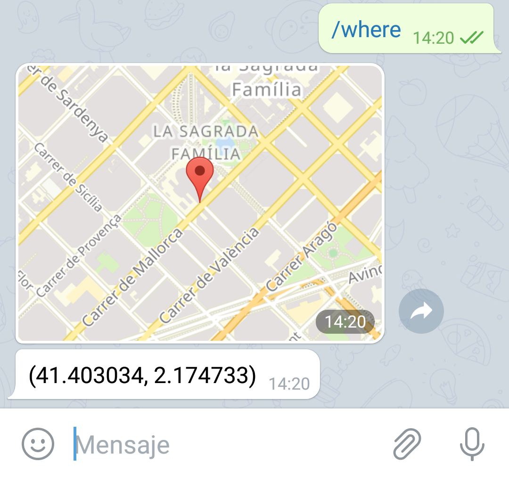
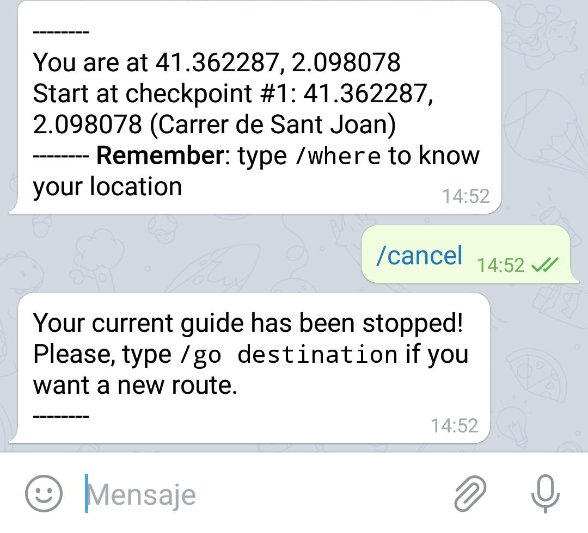
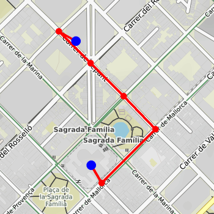

# GuideBot

GuideBot is a Telegram bot that will guide you from your current location to any place you want in Barcelona, through an interactive user chat experience. The bot uses several algorithms implemented with [networkx](https://networkx.github.io/documentation/stable/) on OpenStreetMaps maps, with the abstract layer of [osmnx](https://github.com/gboeing/osmnx).

## Architecture

GuideBot has two main modules:

1. **Bot module**: Telegram-bot module that guides the user to his destination.
2. **Guide module**: low-level module that provides essential functions to treat and compute graphs from OpenStreetMaps using osmnx and networkx.

## Installation

### Prerequisites

GuideBot uses various algorithms to get an accurate and detailed guidance to your destination, you will need these libraries to make it work:

```
$ pip install osmnx
$ pip install networkx
$ pip install staticmap
$ pip install haversine
$ pip install python-telegram-bot
```

### Bot configuration

Once you have installed all the requirements, you will have to create a Telegram bot with your token and associate your bot with the GuideBot module.

1. Visit [BotFather](https://telegram.me/botfather)

2. Use the command `/newbot` to create a new bot. The BotFather will ask you for a name and username, then generate an authorization token for your new bot.

3. Save your *access token* using a `token.txt` file in the bot's files directory.

4. Execute the bot.py file through a terminal as:

   ```
   $ python3 bot.py
   ```

   (or whatever python version you're using) and voila! GuideBot is now running in the bot associated with your *access token*.

Click [here](https://core.telegram.org/bots#6-botfather) if you want a further explanation of the bot installation.

## Usage

### Bot module

GuideBot has 5 main commands: 

- `/start`: starts the conversation with **GuideBot**.
- `/help`: offers help for the available commands.
-  `/author`: displays the author of the project.
-  `/go destination`: guides the user from his current location to the *destination*. e.g: `/go` *Sagrada Família*.
-  `/where`: displays the current location of the user.
-  `/cancel`: stops the active user guide system.

`/start`, `/help` and `/author` are self-explanatory. We will go into the details on the remaining commands.

#### `/go`

This is the main command of the bot. This command will enable the user guide system and begin the travel of the user to the destination through several checkpoints. The user **must** have live location enabled to use this command. GuideBot will use user's current location to guide him through these checkpoints. Keep in mind that Telegram live location has a certain latency; if you go too fast between checkpoints, one may be skipped.

Moreover, an image of the shortest route will be displayed in the user's chat. Here is an example:

|                                                  |                                                              |
| :----------------------------------------------: | :----------------------------------------------------------: |
|  |  |

As you can see, the user must start at a given checkpoint. From there, the user will have to follow every checkpoint until he arrives to the destination. If a user skips a given checkpoint, after a few seconds the whole route will be recalculated, and the user will have to start from his nearest checkpoint.

#### `/where`

Displays user's current location at any moment. To use this command, user **must** have enabled live location in Telegram. As before, Telegram live location has a certain latency; current location may have a delay of a few seconds. An example of the command:



#### `/cancel`

Stops the current guide system of the user. This means that the user's current route to his destination will be vanished, and the bot will wait for another route given with `/go destination` command. This is useful if the user wants to change his destination, or if he typed his destination wrongly. Here is an example:



### Guide module

Guide module provides essential functions to treat and compute graphs from OpenStreetMaps using osmnx and networkx.

#### Create and download a graph

```python
G = download_graph(place)
```

Downloads and returns a networkx graph of `place` from OSM data

| parameter | description                 |
| --------- | --------------------------- |
| place     | name of desired place graph |

#### Save a graph

```python
save_graph(graph, filename)
```

Saves a given graph in pickle format.

| parameter | description            |
| --------- | ---------------------- |
| graph     | newtorkx-based graph   |
| filename  | name of the saved file |

#### Load a graph

```python
G = load_graph(filename)
```

| parameter | description             |
| --------- | ----------------------- |
| filename  | name of the loaded file |

#### Print a graph

```python
print_graph(graph)
```

Prints all nodes and edges from the graph, including it's attributes

| parameter | description          |
| --------- | -------------------- |
| graph     | networkx-based graph |

#### Find the shortest path

```
directions = get_directions(graph, source_location, destination_location)
```

Computes the shortest path from the source location to the destination location and returns a dictionary with basic information of every edge of the shortest path.

| parameter            | description                                        |
| -------------------- | -------------------------------------------------- |
| filename             | name of the loaded file                            |
| source_location      | (lat, lon) coordinates of the source location      |
| destination_location | (lat, lon) coordinates of the destination location |

#### Plot a given route

```
plot_directions(graph, source_location, destination_location, directions, filename, width=400, height=400)
```

Plots a given route and saves in current directory an image of this plot.

| parameter            | description                                        |
| -------------------- | -------------------------------------------------- |
| filename             | name of the loaded file                            |
| source_location      | (lat, lon) coordinates of the source location      |
| destination_location | (lat, lon) coordinates of the destination location |
| directions           | list of dictionaries created with get_directions   |
| filename             | name of the saved image (remember the .png!)       |
| width                | (optional) width of the image                      |
| height               | (optional) height of the image                     |

#### Example

```python
import guide as gd

#Downloads Barcelona's graphs
graph = gd.download_graph('Barcelona, Spain')

#Saves Barcelona's graph on mygraph file in pickle format
gd.save_graph(graph, "mygraph")

#Loads in G the graph saved in mygraph
G = gd.load_graph("mygraph")

#Gets the shortest path from two lat/lon coordinates
directions = gd.get_directions(G, (41.406741, 2.173886), (41.403478, 2.174410))

#Plots the shortest path
gd.plot_directions(G, (41.406741, 2.173886), (41.403478, 2.174410), directions, "image.png")
```

Image created:



## Contributing

Suggestions or bug reports are welcomed. Please contact via: [joel.castano@est.fib.upc.edu ](joel.castano@est.fib.upc.edu) 

## License

[MIT](https://choosealicense.com/licenses/mit/)